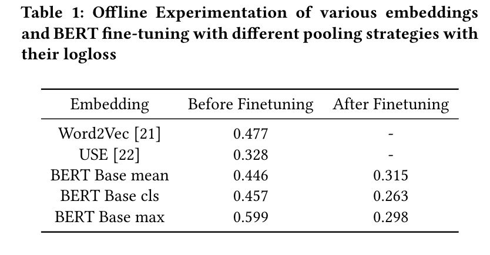

# Bert Finetuning

Finetuning the BERT model on glance data to get more semantically informative embeddings

## Training

The following framework allows you to finetune the BERT model based on your own domain data.

#### Training data steps

The framework utilizes a siamese network structure on a given base BERT model and adds a pooling layer on top of it, followed by a softmax classifier.
The training data consists of 3 columns, with the first two consisting of sentence A and sentence B while the third column contains a label marking the 2 given sentences as semantically similar or dissimilar.

Each sentence is passed to a transformer model wherein it generates a fixed size embedding for it, and then is passed to a softmax classifier to derive the final label.

#### Evaluation

We evaluated the finetuned BERT embeddings on our downstream tasks and saw gains of 18% in logloss.

####

